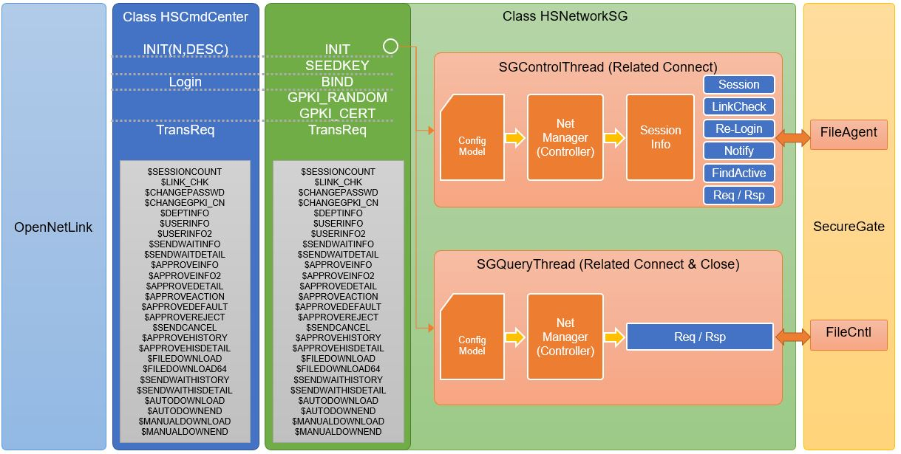
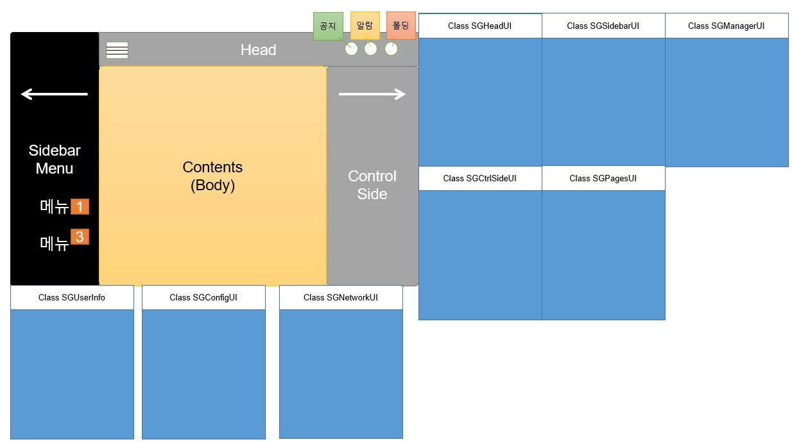

## Welcome to the OpenNetLink project.

   
    

[CrossPlatform](https://ko.wikipedia.org/wiki/%ED%81%AC%EB%A1%9C%EC%8A%A4_%ED%94%8C%EB%9E%AB%ED%8F%BC)(.Net Core + Blazor) based on the development of OpenNetLink (network-connected agent of SecureGate).

  

If you want to develop a cross-platform-based program or work on a project through collaboration, please do not hesitate to participate.

If you are working on a collaborative project for the first time through GitHub, please refer to the [Contributor Guide Doc](docs/CONTRIBUTE_GUIDE.md).

# SecureGate

  

# Open NetLink

  

* Framework Stack structure

  

* Open NetLink structure

  

* Network Library structure

  

* UI class structure

  

##  Document
* [UI Scenario](docs/NetLink_UI%EC%8B%9C%EB%82%98%EB%A6%AC%EC%98%A4_v1.0.pptx)
* [Function Specification](docs/NetLink_%EA%B8%B0%EB%8A%A5.%EB%A6%AC%EC%8A%A4%ED%8A%B8.Spec_V1.0.xlsx)
* [Function detailed Specification](docs/NetLink_%EA%B8%B0%EB%8A%A5%EB%A6%AC%EC%8A%A4%ED%8A%B8_%EC%83%81%EC%84%B8%EC%84%A4%EA%B3%84%EC%84%9C_V1.0.docx)

## Coding conventions
Please refer to [Define Coding Rules](docs/CODING_ROLE.md) for unification of coding style when developing a project.

## License
Apache 2.0

