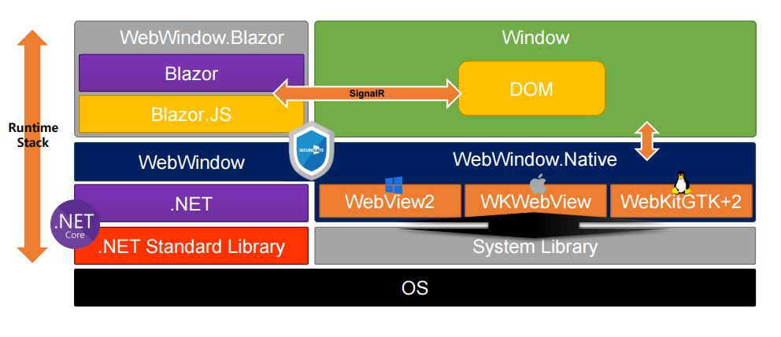
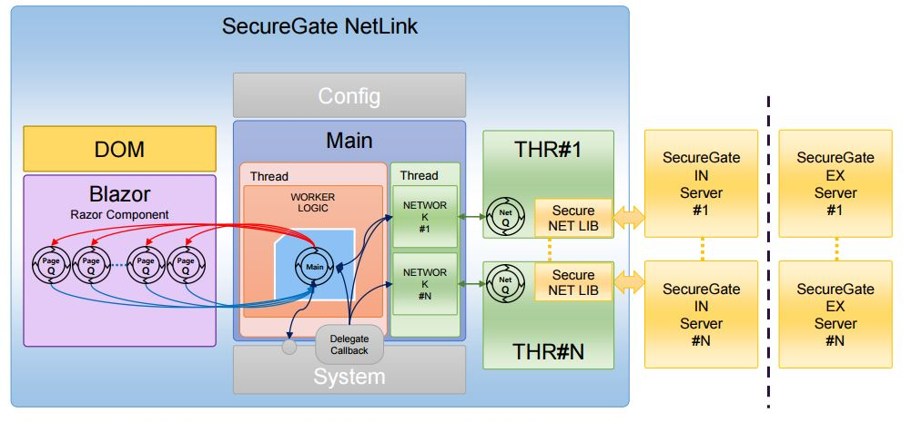

Open NetLink 프로젝트 방문을 환영합니다.

[크로스플랫폼](https://ko.wikipedia.org/wiki/%ED%81%AC%EB%A1%9C%EC%8A%A4_%ED%94%8C%EB%9E%AB%ED%8F%BC)(.Net Core + Blazor) 기반에 Open NetLink(망연계 Agent) 개발을 목표로 하고 있습니다.

크로스플랫폼 기반의 프로그램을 개발하고 싶거나 협업을 통해 프로젝트를 진행해보고 싶다면 주저말고 참여해 주세요.

GitHub를 통해 협업 프로젝트를 처음 진행하시면 [컨트리뷰터 가이드](docs/CONTRIBUTE_GUIDE.md)를 참고해 주시기 바랍니다.

# Open NetLink
* Framework Stack 구조

* Open NetLink 구조

##  문서

* [UI 시나리오](docs/NetLink_UI%EC%8B%9C%EB%82%98%EB%A6%AC%EC%98%A4_v1.0.pptx)
* [기능 명세서](docs/NetLink_%EA%B8%B0%EB%8A%A5.%EB%A6%AC%EC%8A%A4%ED%8A%B8.Spec_V1.0.xlsx)
* [기능 상세 명세서](docs/NetLink_%EA%B8%B0%EB%8A%A5%EB%A6%AC%EC%8A%A4%ED%8A%B8_%EC%83%81%EC%84%B8%EC%84%A4%EA%B3%84%EC%84%9C_V1.0.docx)
 
## 코딩 규칙

프로젝트 개발 시 코딩 스타일 일원화를 위해 [코딩 규칙 정의](docs/CODING_ROLE.md)를 참고하세요.
